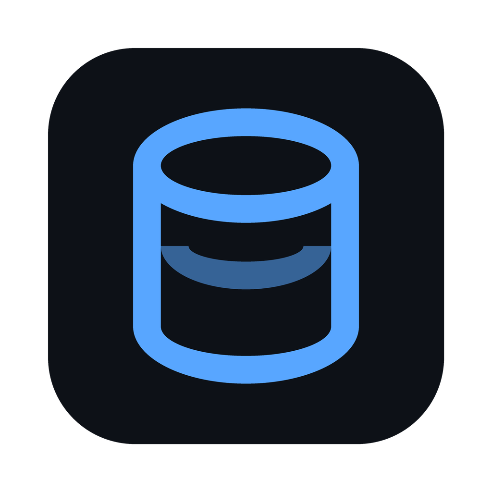

<div align="center">



<h1>warden</h1>

<p><b>Every database has a door. warden is the guy standing at it.</b></p>

<p>


<a href="LICENSE"></a>
</p>

</div>

warden holds the keys to your databases. It decides who gets in, what they can touch, and who gets kicked out, and it writes down every bit of it. Before it runs a query it reads the thing back to you in plain english ("Updates ONE document in `orders` where `_id` = ..."), so you know exactly what you're about to do to prod.

Six engines, one core, three ways to drive it: a CLI, a web UI, and a desktop app.

| engine | also covers |
|---|---|
| **MongoDB** | DocumentDB |
| **PostgreSQL** | Aurora, RDS |
| **MySQL** | MariaDB |
| **SQLite** | just a file, no server |
| **Elasticsearch** | OpenSearch |
| **Redis** | Valkey, ElastiCache, MemoryDB |

They all sit on the same footing: connect, browse, query, health, in-grid CRUD, and real user management (native-realm users and roles for ES, ACL users for Redis).

## What it does

**Users & access.** Create, drop, reset passwords, grant and revoke, each behind a confirm step. Test a user's real login to see what they can actually touch.

**Browse & query.** A rows-and-columns browser for any table, collection, or index (keys, for Redis), with server-side search and in-grid CRUD that's locked by default. The query console previews every statement in plain english and flags the scary ones before they run. ⌘K jumps anywhere; copy any row as JSON or a ready-to-paste INSERT.

**Guardrails.** Tag a connection prod/staging/dev and warden paints the bar red on prod and defaults it to read-only, so you don't fat-finger the wrong environment. Smart filters (`role:kibana_admin`, `size:>100mb`) slice the long lists. Every change lands in an append-only audit log.

**Insight.** Security audits (who's admin, who can write where, dead accounts) and cluster health (connections, slow queries, cache hit, replication lag), so you spot the problem before it spots you.

## Run it

You'll need [uv](https://docs.astral.sh/uv/).

```sh
make setup
make dev        # web UI at http://127.0.0.1:8642
```

Nothing ships pre-configured. Open Settings > Environments to add your clusters, or import a backup.

| command | what you get |
|---|---|
| `make dev` | web UI, auto reload |
| `make dev-desktop` | desktop app, auto restart |
| `make cli ARGS="docdb list-users"` | the CLI |
| `make build` · `build-desktop` · `dmg` | wheels, native bundle, macOS installer |

No make? `uv run warden` / `warden-web` / `warden-desktop`. Builds for other OSes come from CI on a `v*` tag (PyInstaller can't cross compile).

### No Python? Docker.

```sh
docker compose up        # web UI at http://localhost:8642
```

The image bundles the DB clients (psql, mysql, mongosh, sqlite3), so the query console works for every engine. To reach a database on your host machine, use `host.docker.internal` in place of `localhost`.

## Tests

```sh
make test              # python unit + JS filter tests, no databases needed
make test-integration  # drives live engines, skips any that aren't up
```

Need engines to test against? `cd tests/engines && ./engines.sh up` starts all five with the creds the tests expect. Full story in [`tests/`](tests/).

## Config

Environments live wherever suits you: server profiles in `~/.warden/profiles.sqlite` (shared by all three interfaces), plain JSON (`environments.local.json`, or wherever `WARDEN_ENVIRONMENTS_FILE` points), browser-local, or a backup import. Credentials save per env + engine, with optional macOS Keychain. The audit trail sits at `~/.warden/audit.log`.

Engine keys match loosely by name, so `aurora-mysql`, `elasticache-redis`, and `opensearch` all find the right driver. (Redis is checked before Elasticsearch on purpose, since "elasticache" contains "elastic".)

A few quirks worth knowing: SQLite is just a file, so it has no users and those pages hide themselves. ES and Redis often need no credentials, leave the fields blank. TLS verifies certs by default; tick **trust invalid cert** for self-signed or private CAs (RDS, DocumentDB, ElastiCache). And the web server only answers same-origin requests, so a random page you visit can't drive it.

## Digging in

Every folder has its own short guide. Start with [`packages/core/`](packages/core/) (the muscle) and [`adapters/`](packages/core/src/warden_core/adapters/) (one class per engine). A few gotchas that'll save you an afternoon:

- the web server reads the UI off disk on every request, so frontend edits are just a browser refresh
- structured ops go through pooled native drivers; mongosh and psql are only for the free-form query console, and each engine falls back to its CLI if the driver isn't importable
- mongosh silently ignores `--db`, so the target database goes in the connection URI instead. Don't "fix" that

<div align="center"><sub>MIT licensed. Be nice to prod.</sub></div>
